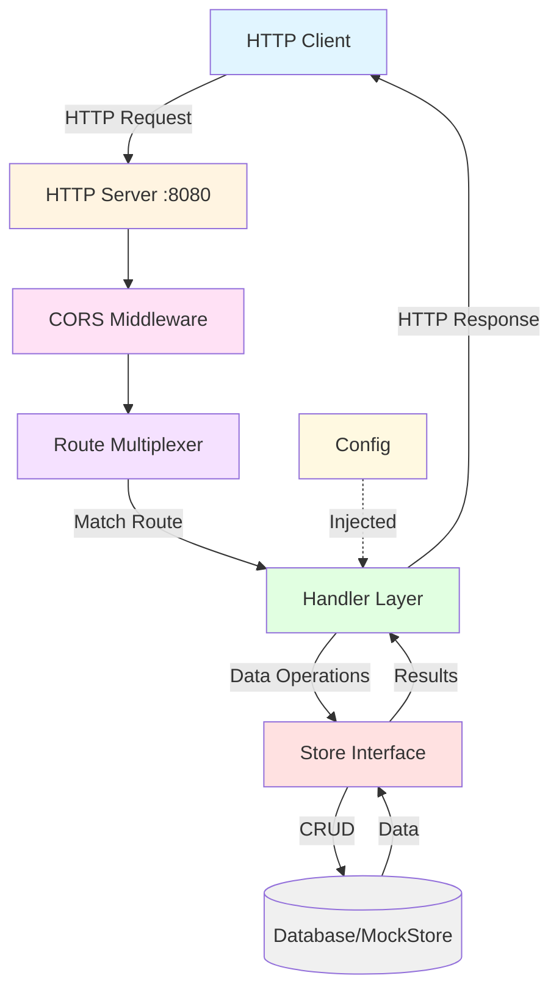
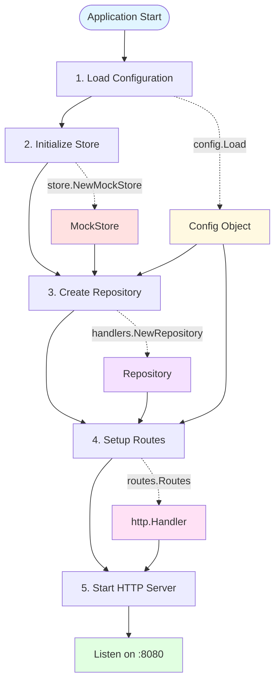
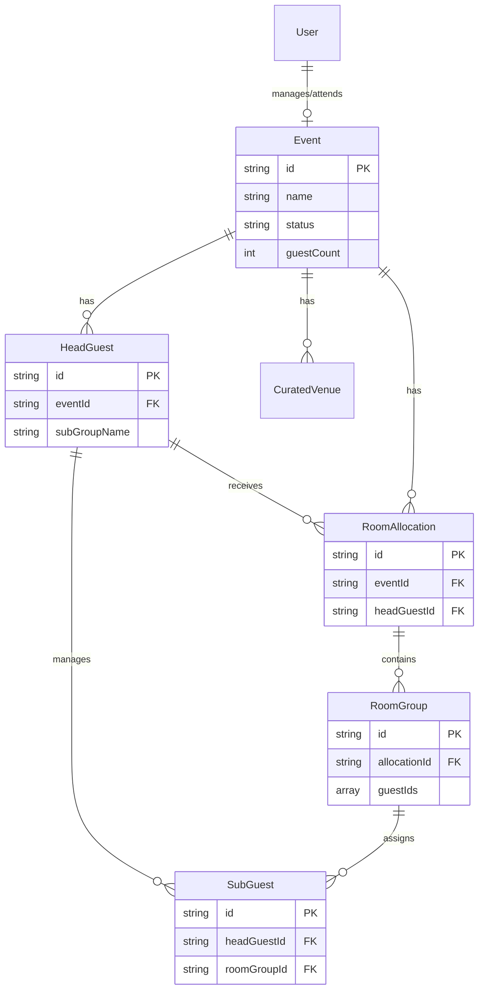
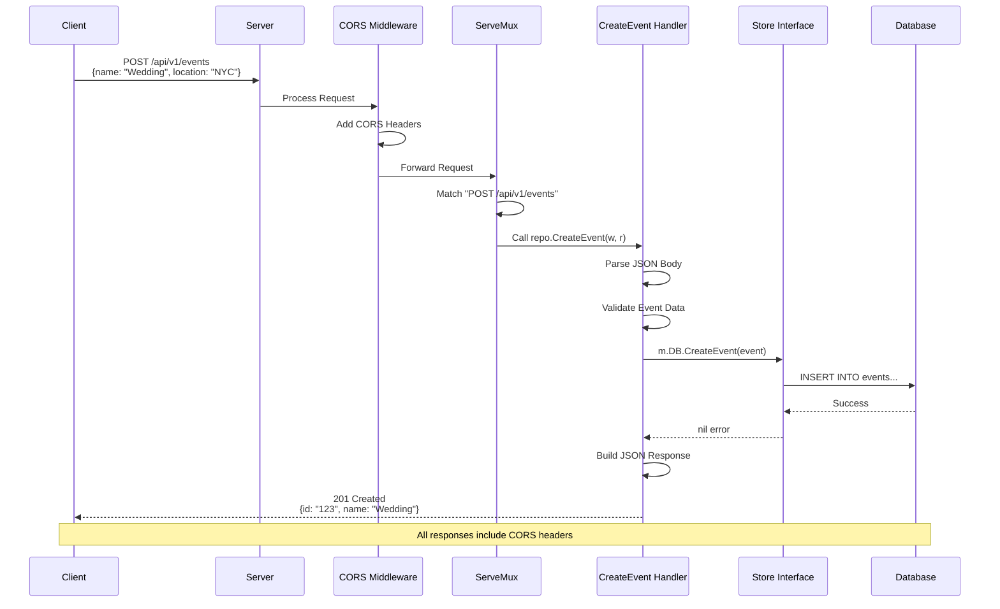
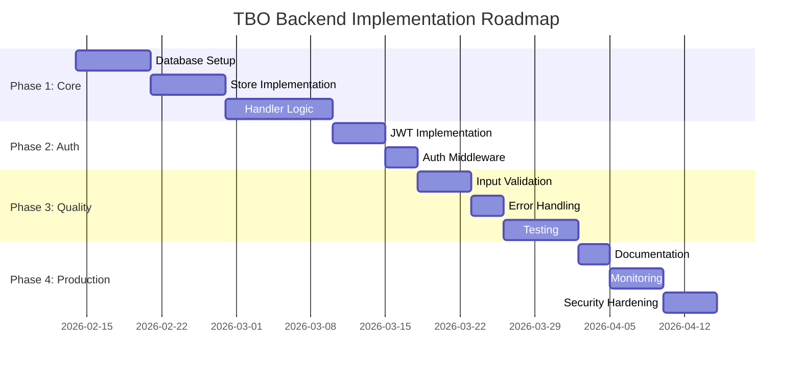

# TBO Backend - Complete Technical Documentation

## Table of Contents
1. [Project Overview](#project-overview)
2. [Architecture Overview](#architecture-overview)
3. [Application Bootstrap & Wiring](#application-bootstrap--wiring)
4. [Configuration System](#configuration-system)
5. [Data Models](#data-models)
6. [Store Layer (Data Access)](#store-layer-data-access)
7. [Handler Layer (Business Logic)](#handler-layer-business-logic)
8. [Routing System](#routing-system)
9. [Middleware Layer](#middleware-layer)
10. [Complete Request Flow](#complete-request-flow)
11. [API Endpoints Reference](#api-endpoints-reference)
12. [Development Status](#development-status)

---

## Project Overview

**TBO_Backend** is a Go-based REST API backend for managing events (weddings/corporate), guests, room allocations, and venue bookings. It follows a clean architecture pattern with clear separation of concerns.

### Technology Stack
- **Language**: Go 1.25.5
- **HTTP Framework**: Standard library `net/http` with `http.NewServeMux()`
- **Architecture Pattern**: Repository Pattern with Dependency Injection
- **Module Path**: `github.com/akashtripathi12/TBO_Backend`

### Project Structure
```
TBO_BACKEND/
├── cmd/
│   └── api/
│       └── main.go              # Application entry point
├── internal/
│   ├── config/
│   │   └── config.go            # Configuration management
│   ├── handlers/
│   │   ├── handlers.go          # Repository struct
│   │   ├── auth.go              # Authentication handlers
│   │   ├── events.go            # Event management handlers
│   │   ├── guests.go            # Guest management handlers
│   │   └── allocations.go       # Room allocation handlers
│   ├── middleware/
│   │   └── middleware.go        # CORS middleware
│   ├── models/
│   │   └── models.go            # Data models/structs
│   ├── routes/
│   │   └── routes.go            # Route definitions
│   └── store/
│       └── store.go             # Data access interface
├── go.mod                        # Go module definition
├── .gitignore                    # Git ignore rules
└── README.md                     # Project readme
```

---

## Architecture Overview

The application follows a **layered architecture** with clear separation of concerns:



### Key Architectural Principles

1. **Dependency Injection**: Configuration and Store are injected into handlers
2. **Interface-Based Design**: Store is defined as an interface for flexibility
3. **Repository Pattern**: Handlers encapsulate business logic and data access
4. **Standard Library First**: Uses Go's standard `net/http` without external frameworks
5. **Clean Separation**: Each layer has a single responsibility

---

## Application Bootstrap & Wiring

### Complete Startup Flow

The application initialization happens in [`cmd/api/main.go`](file:///t:/TBO_BACKEND/cmd/api/main.go) with a clear 5-step process:



### Detailed Bootstrap Code Analysis

#### Step 1: Load Configuration
```go
appConfig := config.Load()
log.Printf("Loaded configuration for env: %s", appConfig.Env)
```
- Creates a `*config.Config` instance
- Currently hardcoded to port `:8080` and environment `development`
- Logs the loaded environment

#### Step 2: Initialize Store
```go
db := store.NewMockStore()
```
- Creates a `MockStore` that implements the `Store` interface
- Currently returns `nil` for all operations (placeholder implementation)
- In production, this would be replaced with actual database connection

#### Step 3: Initialize Repository/Handlers
```go
repo := handlers.NewRepository(appConfig, db)
```
- Creates a `Repository` struct that holds:
  - `App`: The application configuration
  - `DB`: The store interface for data access
- This repository is the **central hub** for all handler methods

#### Step 4: Setup Routes
```go
srv := &http.Server{
    Addr:    appConfig.Port,
    Handler: routes.Routes(appConfig, repo),
}
```
- Calls `routes.Routes()` which:
  1. Creates a new `http.ServeMux`
  2. Registers all API endpoints
  3. Wraps the mux with CORS middleware
  4. Returns an `http.Handler`
- Creates an `http.Server` instance with the handler

#### Step 5: Start Server
```go
log.Printf("Starting server on %s...", appConfig.Port)
err := srv.ListenAndServe()
if err != nil {
    log.Fatal(err)
}
```
- Starts the HTTP server on port `:8080`
- Blocks and listens for incoming requests
- Logs fatal error if server fails to start

---

## Configuration System

Location: [`internal/config/config.go`](file:///t:/TBO_BACKEND/internal/config/config.go)

### Config Structure
```go
type Config struct {
    Port string  // Server port (e.g., ":8080")
    Env  string  // Environment (e.g., "development")
}
```

### Load Function
```go
func Load() *Config {
    return &Config{
        Port: ":8080",
        Env:  "development",
    }
}
```

> [!NOTE]
> Currently hardcoded values. In production, this should read from:
> - Environment variables
> - Configuration files (JSON/YAML)
> - Command-line flags

### Future Enhancements
- Database connection strings
- JWT secret keys
- API rate limits
- External service URLs
- Feature flags

---

## Data Models

Location: [`internal/models/models.go`](file:///t:/TBO_BACKEND/internal/models/models.go)

The models define the core domain entities for the TBO platform.

### 1. Event Model
```go
type Event struct {
    ID                string `json:"id"`
    Name              string `json:"name"`
    Location          string `json:"location"`
    StartDate         string `json:"startDate"`
    EndDate           string `json:"endDate"`
    Organizer         string `json:"organizer"`
    GuestCount        int    `json:"guestCount"`
    HotelCount        int    `json:"hotelCount"`
    InventoryConsumed int    `json:"inventoryConsumed"`
    Status            string `json:"status"` // 'active' | 'upcoming' | 'completed'
}
```
**Purpose**: Represents a wedding or corporate event
**Key Fields**:
- `Status`: Tracks event lifecycle (active/upcoming/completed)
- `GuestCount`: Total number of guests
- `HotelCount`: Number of hotels involved
- `InventoryConsumed`: Rooms/resources used

### 2. Guest Hierarchy

#### HeadGuest (Primary Contact)
```go
type HeadGuest struct {
    ID           string `json:"id"`
    Name         string `json:"name"`
    Email        string `json:"email"`
    Phone        string `json:"phone"`
    EventID      string `json:"eventId"`
    SubGroupName string `json:"subGroupName"` // e.g., "Bride's Family"
}
```
**Purpose**: Primary contact for a group of guests
**Relationship**: One HeadGuest can have multiple SubGuests

#### SubGuest (Individual Guest)
```go
type SubGuest struct {
    ID          string `json:"id"`
    Name        string `json:"name"`
    Email       string `json:"email,omitempty"`
    Phone       string `json:"phone,omitempty"`
    Age         int    `json:"age,omitempty"`
    GuestCount  int    `json:"guestCount"` // Defaults to 1
    HeadGuestID string `json:"headGuestId"`
    RoomGroupID string `json:"roomGroupId,omitempty"` // null if unassigned
}
```
**Purpose**: Individual guest under a HeadGuest
**Key Fields**:
- `GuestCount`: Allows representing multiple people as one entry
- `RoomGroupID`: Links to room assignment (nullable)

### 3. Room Management

#### RoomAllocation (Room Block)
```go
type RoomAllocation struct {
    ID          string `json:"id"`
    EventID     string `json:"eventId"`
    HeadGuestID string `json:"headGuestId"`
    RoomType    string `json:"roomType"` // e.g., "Deluxe Room", "Suite"
    MaxCapacity int    `json:"maxCapacity"`
    HotelName   string `json:"hotelName"`
}
```
**Purpose**: Block of rooms allocated to a HeadGuest
**Relationship**: One allocation can have multiple RoomGroups

#### RoomGroup (Specific Assignment)
```go
type RoomGroup struct {
    ID           string   `json:"id"`
    AllocationID string   `json:"allocationId"`
    GuestIDs     []string `json:"guestIds"` // SubGuest IDs assigned to this room
    CustomLabel  string   `json:"customLabel,omitempty"`
}
```
**Purpose**: Specific assignment of SubGuests to a room
**Key Fields**:
- `GuestIDs`: Array of SubGuest IDs in this room
- `CustomLabel`: Optional custom name for the room

### 4. Venue Model
```go
type CuratedVenue struct {
    ID          string   `json:"id"`
    Name        string   `json:"name"`
    Location    string   `json:"location"`
    Description string   `json:"description"`
    Images      []string `json:"images"`
    Amenities   []string `json:"amenities"`
    EventID     string   `json:"eventId"`
}
```
**Purpose**: Hotel or venue option for an event

### 5. Analytics Model
```go
type MetricData struct {
    Label  string      `json:"label"`
    Value  interface{} `json:"value"` // string or number
    Change int         `json:"change,omitempty"`
    Trend  string      `json:"trend,omitempty"` // 'up' | 'down' | 'neutral'
}
```
**Purpose**: Dashboard analytics and metrics

### 6. Authentication Models

#### User
```go
type User struct {
    ID      string `json:"id"`
    Name    string `json:"name"`
    Email   string `json:"email"`
    Role    string `json:"role"` // 'agent' | 'guest'
    EventID string `json:"eventId,omitempty"`
}
```

#### AuthCredentials
```go
type AuthCredentials struct {
    Email    string `json:"email"`
    Password string `json:"password"`
    Role     string `json:"role"`
}
```

### Entity Relationship Diagram



---

## Store Layer (Data Access)

Location: [`internal/store/store.go`](file:///t:/TBO_BACKEND/internal/store/store.go)

### Store Interface

The `Store` interface defines all data access methods:

```go
type Store interface {
    // Auth
    GetUserByEmail(email string) (*models.User, error)
    GetAgentCredentials() (*models.AuthCredentials, error)

    // Events
    GetEvents() ([]models.Event, error)
    GetEventByID(id string) (*models.Event, error)
    CreateEvent(event models.Event) error
    GetMetrics() ([]models.MetricData, error)

    // Guests
    GetGuestsByEventID(eventID string) ([]models.HeadGuest, error)
    GetGuestByID(id string) (*models.HeadGuest, error)
    AddHeadGuest(guest models.HeadGuest) error

    // SubGuests
    GetSubGuestsByHeadGuestID(headGuestID string) ([]models.SubGuest, error)

    // Allocations
    GetAllocationsByEventID(eventID string) ([]models.RoomAllocation, error)

    // Venues
    GetVenuesByEventID(eventID string) ([]models.CuratedVenue, error)
}
```

### MockStore Implementation

Currently, a `MockStore` is used as a placeholder:

```go
type MockStore struct{}

func NewMockStore() *MockStore {
    return &MockStore{}
}

// All methods return nil/empty
func (m *MockStore) GetUserByEmail(email string) (*models.User, error) { 
    return nil, nil 
}
// ... (all other methods similarly return nil)
```

> [!WARNING]
> **MockStore is a placeholder!** All methods currently return `nil`. This needs to be replaced with:
> - PostgreSQL/MySQL implementation
> - MongoDB implementation
> - In-memory implementation for testing

### Future Implementation Pattern

```go
type PostgresStore struct {
    db *sql.DB
}

func (p *PostgresStore) GetEventByID(id string) (*models.Event, error) {
    var event models.Event
    err := p.db.QueryRow(
        "SELECT id, name, location FROM events WHERE id = $1", 
        id,
    ).Scan(&event.ID, &event.Name, &event.Location)
    return &event, err
}
```

---

## Handler Layer (Business Logic)

Location: [`internal/handlers/`](file:///t:/TBO_BACKEND/internal/handlers/)

### Repository Pattern

The `Repository` struct is the central handler container:

```go
type Repository struct {
    App *config.Config  // Application configuration
    DB  store.Store     // Data access interface
}

func NewRepository(app *config.Config, db store.Store) *Repository {
    return &Repository{
        App: app,
        DB:  db,
    }
}
```

All handler methods are **receiver methods** on `*Repository`, giving them access to:
- Configuration via `m.App`
- Database operations via `m.DB`

### Handler Files Organization

| File | Purpose | Handlers |
|------|---------|----------|
| [`handlers.go`](file:///t:/TBO_BACKEND/internal/handlers/handlers.go) | Repository struct definition | - |
| [`auth.go`](file:///t:/TBO_BACKEND/internal/handlers/auth.go) | Authentication & authorization | 4 handlers |
| [`events.go`](file:///t:/TBO_BACKEND/internal/handlers/events.go) | Event management | 7 handlers |
| [`guests.go`](file:///t:/TBO_BACKEND/internal/handlers/guests.go) | Guest management | 6 handlers |
| [`allocations.go`](file:///t:/TBO_BACKEND/internal/handlers/allocations.go) | Room allocations | 2 handlers |

### Authentication Handlers

Location: [`internal/handlers/auth.go`](file:///t:/TBO_BACKEND/internal/handlers/auth.go)

#### 1. LoginAgent
```go
func (m *Repository) LoginAgent(w http.ResponseWriter, r *http.Request)
```
- **Purpose**: Authenticate agent users
- **Current Status**: Placeholder (returns "Agent Login Endpoint")
- **Future Implementation**:
  - Parse credentials from request body
  - Validate against `m.DB.GetAgentCredentials()`
  - Generate JWT token
  - Return token + user info

#### 2. LoginGuest
```go
func (m *Repository) LoginGuest(w http.ResponseWriter, r *http.Request)
```
- **Purpose**: Authenticate guest users
- **Current Status**: Placeholder
- **Future Implementation**:
  - Validate guest credentials
  - Check event association
  - Generate session token

#### 3. Logout
```go
func (m *Repository) Logout(w http.ResponseWriter, r *http.Request)
```
- **Purpose**: Invalidate user session
- **Current Status**: Placeholder
- **Future Implementation**:
  - Invalidate JWT/session token
  - Clear cookies/headers

#### 4. GetCurrentUser
```go
func (m *Repository) GetCurrentUser(w http.ResponseWriter, r *http.Request)
```
- **Purpose**: Get authenticated user details
- **Current Status**: Placeholder
- **Future Implementation**:
  - Extract token from Authorization header
  - Validate and decode token
  - Return user information

### Event Handlers

Location: [`internal/handlers/events.go`](file:///t:/TBO_BACKEND/internal/handlers/events.go)

#### 1. GetEvents
```go
func (m *Repository) GetEvents(w http.ResponseWriter, r *http.Request)
```
- **Purpose**: List all events
- **Future**: Call `m.DB.GetEvents()` and return JSON array

#### 2. GetEvent
```go
func (m *Repository) GetEvent(w http.ResponseWriter, r *http.Request)
```
- **Purpose**: Get single event by ID
- **Route Parameter**: `{id}` from URL path
- **Future**: Extract ID, call `m.DB.GetEventByID(id)`

#### 3. CreateEvent
```go
func (m *Repository) CreateEvent(w http.ResponseWriter, r *http.Request)
```
- **Purpose**: Create new event
- **Future**: Parse JSON body, validate, call `m.DB.CreateEvent()`

#### 4. UpdateEvent
```go
func (m *Repository) UpdateEvent(w http.ResponseWriter, r *http.Request)
```
- **Purpose**: Update existing event
- **Route Parameter**: `{id}`

#### 5. DeleteEvent
```go
func (m *Repository) DeleteEvent(w http.ResponseWriter, r *http.Request)
```
- **Purpose**: Delete event
- **Route Parameter**: `{id}`

#### 6. GetMetrics
```go
func (m *Repository) GetMetrics(w http.ResponseWriter, r *http.Request)
```
- **Purpose**: Get dashboard analytics
- **Future**: Call `m.DB.GetMetrics()`

#### 7. GetEventVenues
```go
func (m *Repository) GetEventVenues(w http.ResponseWriter, r *http.Request)
```
- **Purpose**: Get venues for an event
- **Route Parameter**: `{id}` (event ID)

#### 8. GetEventAllocations
```go
func (m *Repository) GetEventAllocations(w http.ResponseWriter, r *http.Request)
```
- **Purpose**: Get room allocations for an event
- **Route Parameter**: `{id}` (event ID)

### Guest Handlers

Location: [`internal/handlers/guests.go`](file:///t:/TBO_BACKEND/internal/handlers/guests.go)

#### 1. GetGuests
```go
func (m *Repository) GetGuests(w http.ResponseWriter, r *http.Request)
```
- **Purpose**: Get all guests for an event
- **Route Parameter**: `{id}` (event ID)

#### 2. GetGuest
```go
func (m *Repository) GetGuest(w http.ResponseWriter, r *http.Request)
```
- **Purpose**: Get single guest by ID
- **Route Parameter**: `{id}` (guest ID)

#### 3. CreateGuest
```go
func (m *Repository) CreateGuest(w http.ResponseWriter, r *http.Request)
```
- **Purpose**: Create new head guest

#### 4. UpdateGuest
```go
func (m *Repository) UpdateGuest(w http.ResponseWriter, r *http.Request)
```
- **Purpose**: Update guest information
- **Route Parameter**: `{id}`

#### 5. DeleteGuest
```go
func (m *Repository) DeleteGuest(w http.ResponseWriter, r *http.Request)
```
- **Purpose**: Delete guest
- **Route Parameter**: `{id}`

#### 6. AddSubGuest
```go
func (m *Repository) AddSubGuest(w http.ResponseWriter, r *http.Request)
```
- **Purpose**: Add sub-guest to a head guest
- **Route Parameter**: `{id}` (head guest ID)

### Allocation Handlers

Location: [`internal/handlers/allocations.go`](file:///t:/TBO_BACKEND/internal/handlers/allocations.go)

#### 1. CreateAllocation
```go
func (m *Repository) CreateAllocation(w http.ResponseWriter, r *http.Request)
```
- **Purpose**: Create new room allocation

#### 2. UpdateAllocation
```go
func (m *Repository) UpdateAllocation(w http.ResponseWriter, r *http.Request)
```
- **Purpose**: Update room allocation
- **Route Parameter**: `{id}`

---

## Routing System

Location: [`internal/routes/routes.go`](file:///t:/TBO_BACKEND/internal/routes/routes.go)

### Routes Function

The `Routes` function is the **routing hub** of the application:

```go
func Routes(app *config.Config, repo *handlers.Repository) http.Handler {
    mux := http.NewServeMux()
    
    // Register all routes...
    
    return middleware.EnableCORS(mux)
}
```

**Key Points**:
1. Creates a new `http.ServeMux` (standard library router)
2. Registers all endpoints with HTTP method + path
3. Wraps with CORS middleware
4. Returns an `http.Handler` interface

### Route Registration Pattern

Go 1.22+ supports method-specific routing:

```go
mux.HandleFunc("POST /api/v1/auth/login/agent", repo.LoginAgent)
```

**Format**: `"METHOD /path"` → Handler function

### Complete Route Table

#### Authentication Routes
| Method | Path | Handler | Purpose |
|--------|------|---------|---------|
| POST | `/api/v1/auth/login/agent` | `LoginAgent` | Agent login |
| POST | `/api/v1/auth/login/guest` | `LoginGuest` | Guest login |
| POST | `/api/v1/auth/logout` | `Logout` | Logout |
| GET | `/api/v1/auth/me` | `GetCurrentUser` | Get current user |

#### Event Routes
| Method | Path | Handler | Purpose |
|--------|------|---------|---------|
| GET | `/api/v1/events` | `GetEvents` | List all events |
| POST | `/api/v1/events` | `CreateEvent` | Create event |
| GET | `/api/v1/events/{id}` | `GetEvent` | Get event by ID |
| PUT | `/api/v1/events/{id}` | `UpdateEvent` | Update event |
| DELETE | `/api/v1/events/{id}` | `DeleteEvent` | Delete event |
| GET | `/api/v1/dashboard/metrics` | `GetMetrics` | Get metrics |
| GET | `/api/v1/events/{id}/venues` | `GetEventVenues` | Get event venues |
| GET | `/api/v1/events/{id}/allocations` | `GetEventAllocations` | Get event allocations |

#### Guest Routes
| Method | Path | Handler | Purpose |
|--------|------|---------|---------|
| GET | `/api/v1/events/{id}/guests` | `GetGuests` | Get guests by event |
| GET | `/api/v1/guests/{id}` | `GetGuest` | Get guest by ID |
| POST | `/api/v1/guests` | `CreateGuest` | Create guest |
| PUT | `/api/v1/guests/{id}` | `UpdateGuest` | Update guest |
| DELETE | `/api/v1/guests/{id}` | `DeleteGuest` | Delete guest |
| POST | `/api/v1/guests/{id}/subguests` | `AddSubGuest` | Add sub-guest |

#### Allocation Routes
| Method | Path | Handler | Purpose |
|--------|------|---------|---------|
| POST | `/api/v1/allocations` | `CreateAllocation` | Create allocation |
| PUT | `/api/v1/allocations/{id}` | `UpdateAllocation` | Update allocation |

### Path Parameters

Routes with `{id}` use Go 1.22+ path parameters:

```go
// In handler:
id := r.PathValue("id")
```

---

## Middleware Layer

Location: [`internal/middleware/middleware.go`](file:///t:/TBO_BACKEND/internal/middleware/middleware.go)

### CORS Middleware

```go
func EnableCORS(next http.Handler) http.Handler {
    return http.HandlerFunc(func(w http.ResponseWriter, r *http.Request) {
        w.Header().Set("Access-Control-Allow-Origin", "*") // TODO: restricting origin
        w.Header().Set("Access-Control-Allow-Methods", "GET, POST, PUT, DELETE, OPTIONS")
        w.Header().Set("Access-Control-Allow-Headers", "Content-Type, Authorization")

        if r.Method == "OPTIONS" {
            w.WriteHeader(http.StatusOK)
            return
        }

        next.ServeHTTP(w, r)
    })
}
```

**Functionality**:
1. **Sets CORS headers** on every response
2. **Handles preflight requests** (OPTIONS method)
3. **Allows all origins** (`*`) - needs restriction in production
4. **Allows common methods**: GET, POST, PUT, DELETE, OPTIONS
5. **Allows headers**: Content-Type, Authorization

> [!WARNING]
> `Access-Control-Allow-Origin: *` is insecure for production. Should be restricted to specific frontend domains.

### Middleware Chaining Pattern

```go
return middleware.EnableCORS(mux)
```

Additional middleware can be chained:
```go
return middleware.Logger(
    middleware.Auth(
        middleware.EnableCORS(mux)
    )
)
```

---

## Complete Request Flow

### Example: Creating an Event

Let's trace a complete request through the system:



### Detailed Step-by-Step Flow

#### 1. Client Sends Request
```http
POST /api/v1/events HTTP/1.1
Host: localhost:8080
Content-Type: application/json

{
  "name": "Smith Wedding",
  "location": "New York",
  "startDate": "2026-06-15",
  "endDate": "2026-06-17"
}
```

#### 2. Server Receives Request
- `http.Server` at `:8080` receives the request
- Passes to the registered `Handler` (from `routes.Routes()`)

#### 3. CORS Middleware Processes
```go
// middleware.EnableCORS wraps the mux
w.Header().Set("Access-Control-Allow-Origin", "*")
w.Header().Set("Access-Control-Allow-Methods", "GET, POST, PUT, DELETE, OPTIONS")
w.Header().Set("Access-Control-Allow-Headers", "Content-Type, Authorization")

// Not an OPTIONS request, so continue
next.ServeHTTP(w, r)
```

#### 4. Router Matches Route
```go
// ServeMux matches "POST /api/v1/events"
mux.HandleFunc("POST /api/v1/events", repo.CreateEvent)
// Calls repo.CreateEvent(w, r)
```

#### 5. Handler Executes (Future Implementation)
```go
func (m *Repository) CreateEvent(w http.ResponseWriter, r *http.Request) {
    // 1. Parse request body
    var event models.Event
    json.NewDecoder(r.Body).Decode(&event)
    
    // 2. Validate
    if event.Name == "" {
        http.Error(w, "Name required", http.StatusBadRequest)
        return
    }
    
    // 3. Generate ID
    event.ID = uuid.New().String()
    
    // 4. Save to database
    err := m.DB.CreateEvent(event)
    if err != nil {
        http.Error(w, err.Error(), http.StatusInternalServerError)
        return
    }
    
    // 5. Return response
    w.Header().Set("Content-Type", "application/json")
    w.WriteHeader(http.StatusCreated)
    json.NewEncoder(w).Encode(event)
}
```

#### 6. Store Layer Executes
```go
func (p *PostgresStore) CreateEvent(event models.Event) error {
    _, err := p.db.Exec(`
        INSERT INTO events (id, name, location, start_date, end_date)
        VALUES ($1, $2, $3, $4, $5)
    `, event.ID, event.Name, event.Location, event.StartDate, event.EndDate)
    return err
}
```

#### 7. Response Sent to Client
```http
HTTP/1.1 201 Created
Content-Type: application/json
Access-Control-Allow-Origin: *
Access-Control-Allow-Methods: GET, POST, PUT, DELETE, OPTIONS
Access-Control-Allow-Headers: Content-Type, Authorization

{
  "id": "550e8400-e29b-41d4-a716-446655440000",
  "name": "Smith Wedding",
  "location": "New York",
  "startDate": "2026-06-15",
  "endDate": "2026-06-17",
  "status": "upcoming"
}
```

---

## API Endpoints Reference

### Authentication Endpoints

#### POST /api/v1/auth/login/agent
**Purpose**: Agent login  
**Request Body**:
```json
{
  "email": "agent@example.com",
  "password": "password123",
  "role": "agent"
}
```
**Response**: JWT token + user info

#### POST /api/v1/auth/login/guest
**Purpose**: Guest login  
**Request Body**:
```json
{
  "email": "guest@example.com",
  "password": "password123",
  "role": "guest"
}
```

#### POST /api/v1/auth/logout
**Purpose**: Logout current user  
**Headers**: `Authorization: Bearer <token>`

#### GET /api/v1/auth/me
**Purpose**: Get current user details  
**Headers**: `Authorization: Bearer <token>`  
**Response**:
```json
{
  "id": "user-123",
  "name": "John Doe",
  "email": "john@example.com",
  "role": "agent"
}
```

### Event Endpoints

#### GET /api/v1/events
**Purpose**: List all events  
**Response**:
```json
[
  {
    "id": "event-1",
    "name": "Smith Wedding",
    "status": "active",
    "guestCount": 150
  }
]
```

#### POST /api/v1/events
**Purpose**: Create new event  
**Request Body**:
```json
{
  "name": "Johnson Wedding",
  "location": "Los Angeles",
  "startDate": "2026-07-01",
  "endDate": "2026-07-03",
  "organizer": "Jane Johnson"
}
```

#### GET /api/v1/events/{id}
**Purpose**: Get event details  
**Path Parameter**: `id` - Event ID

#### PUT /api/v1/events/{id}
**Purpose**: Update event  
**Path Parameter**: `id` - Event ID

#### DELETE /api/v1/events/{id}
**Purpose**: Delete event  
**Path Parameter**: `id` - Event ID

#### GET /api/v1/dashboard/metrics
**Purpose**: Get dashboard metrics  
**Response**:
```json
[
  {
    "label": "Total Events",
    "value": 12,
    "change": 5,
    "trend": "up"
  }
]
```

#### GET /api/v1/events/{id}/venues
**Purpose**: Get venues for event  
**Path Parameter**: `id` - Event ID

#### GET /api/v1/events/{id}/allocations
**Purpose**: Get room allocations for event  
**Path Parameter**: `id` - Event ID

### Guest Endpoints

#### GET /api/v1/events/{id}/guests
**Purpose**: Get all guests for event  
**Path Parameter**: `id` - Event ID

#### GET /api/v1/guests/{id}
**Purpose**: Get guest details  
**Path Parameter**: `id` - Guest ID

#### POST /api/v1/guests
**Purpose**: Create new guest  
**Request Body**:
```json
{
  "name": "John Smith",
  "email": "john@example.com",
  "phone": "+1234567890",
  "eventId": "event-1",
  "subGroupName": "Groom's Family"
}
```

#### PUT /api/v1/guests/{id}
**Purpose**: Update guest  
**Path Parameter**: `id` - Guest ID

#### DELETE /api/v1/guests/{id}
**Purpose**: Delete guest  
**Path Parameter**: `id` - Guest ID

#### POST /api/v1/guests/{id}/subguests
**Purpose**: Add sub-guest to head guest  
**Path Parameter**: `id` - Head Guest ID  
**Request Body**:
```json
{
  "name": "Jane Smith",
  "age": 28,
  "guestCount": 1
}
```

### Allocation Endpoints

#### POST /api/v1/allocations
**Purpose**: Create room allocation  
**Request Body**:
```json
{
  "eventId": "event-1",
  "headGuestId": "guest-1",
  "roomType": "Deluxe Suite",
  "maxCapacity": 4,
  "hotelName": "Grand Hotel"
}
```

#### PUT /api/v1/allocations/{id}
**Purpose**: Update allocation  
**Path Parameter**: `id` - Allocation ID

---

## Development Status

### ✅ Completed Components

1. **Project Structure**: Clean architecture with proper separation
2. **Configuration System**: Basic config loading
3. **Data Models**: Complete domain models defined
4. **Store Interface**: Well-defined data access interface
5. **Handler Structure**: Repository pattern implemented
6. **Routing System**: All routes registered with proper HTTP methods
7. **CORS Middleware**: Basic CORS support
8. **Application Bootstrap**: Clean 5-step initialization

### 🚧 In Progress / TODO

#### High Priority
1. **Implement Handler Logic**
   - All handlers currently return placeholder text
   - Need to implement actual business logic
   - Add request validation
   - Add error handling
   - Implement JSON parsing/encoding

2. **Implement Store Layer**
   - Replace `MockStore` with real database
   - Choose database (PostgreSQL recommended)
   - Implement all Store interface methods
   - Add connection pooling
   - Add transaction support

3. **Authentication & Authorization**
   - Implement JWT token generation/validation
   - Add authentication middleware
   - Add role-based access control
   - Secure password hashing (bcrypt)

4. **Database Schema**
   - Design database tables
   - Create migration scripts
   - Add indexes for performance
   - Set up foreign key constraints

#### Medium Priority
5. **Input Validation**
   - Add request body validation
   - Add path parameter validation
   - Add query parameter validation
   - Return proper error messages

6. **Error Handling**
   - Standardize error responses
   - Add error logging
   - Add error tracking (Sentry, etc.)

7. **Testing**
   - Unit tests for handlers
   - Integration tests for API endpoints
   - Mock store for testing
   - Test coverage reporting

8. **Configuration Enhancement**
   - Environment variable support
   - Configuration file support
   - Secret management
   - Feature flags

#### Low Priority
9. **API Documentation**
   - OpenAPI/Swagger specification
   - API documentation UI
   - Example requests/responses

10. **Performance Optimization**
    - Add caching layer (Redis)
    - Add rate limiting
    - Add request timeout handling
    - Add connection pooling

11. **Monitoring & Logging**
    - Structured logging
    - Request/response logging
    - Performance metrics
    - Health check endpoints

12. **Security Enhancements**
    - Restrict CORS origins
    - Add HTTPS support
    - Add request signing
    - Add API key support
    - Add SQL injection prevention
    - Add XSS prevention

### Implementation Roadmap



---

## Summary

The TBO_Backend is a **well-architected Go REST API** with:

✅ **Clean separation of concerns** across layers  
✅ **Dependency injection** for testability  
✅ **Interface-based design** for flexibility  
✅ **Standard library first** approach  
✅ **Clear request flow** from client to database  

The foundation is solid, but **all handlers are currently placeholders**. The next critical steps are:
1. Implement database layer
2. Implement handler business logic
3. Add authentication/authorization
4. Add comprehensive testing

The architecture supports easy extension and modification as requirements evolve.
